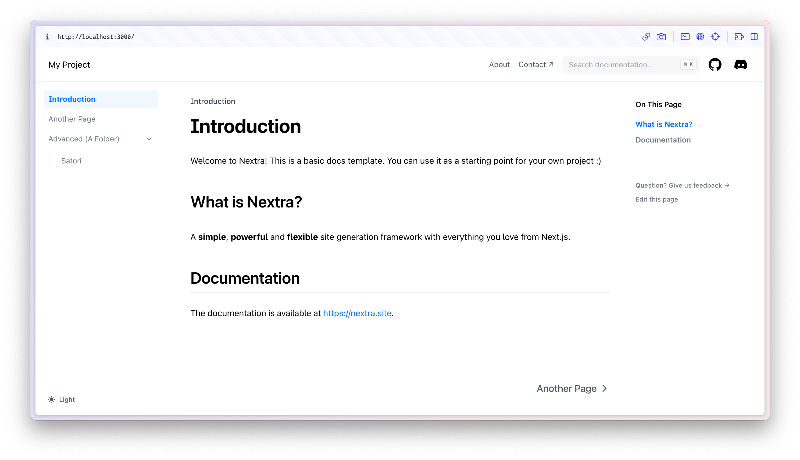

# Nextra Docs Template 

This is a template for creating documentation with [Nextra](https://nextra.site).

[**Live Demo →**](https://nextra-docs-template.vercel.app)

[](https://nextra-docs-template.vercel.app)

## Quick Start

Click the button to clone this repository and deploy it on Vercel:

[](https://vercel.com/new/clone?s=https%3A%2F%2Fgithub.com%2Fshuding%2Fnextra-docs-template&showOptionalTeamCreation=false)

## Local Development

First, run `pnpm i` to install the dependencies.

Then, run `pnpm dev` to start the development server and visit localhost:3000.

## To run with Turbo

First, install turbo with your package manager 
- for pnpm, 
`pnpm add turbo --global`
- for npm,
`npm install turbo --global`
- for yarn,
`yarn global add turbo`

Then, try running build and lint with turbo  `turbo build lint` to run build and lint at the same time.

run `turbo build lint` again, 
you should see output that looks like this:
```
 Tasks:    2 successful, 2 total
Cached:    2 cached, 2 total
  Time:    185ms >>> FULL TURBO
```

* Turbo completes a build and lint in under 200ms

Finally, to run `turbo dev` to start the development server and visit localhost:3000.

You'll notice that your dev script starts up. You can use turbo to run any script in your `package.json.`
## License

This project is licensed under the MIT License.
